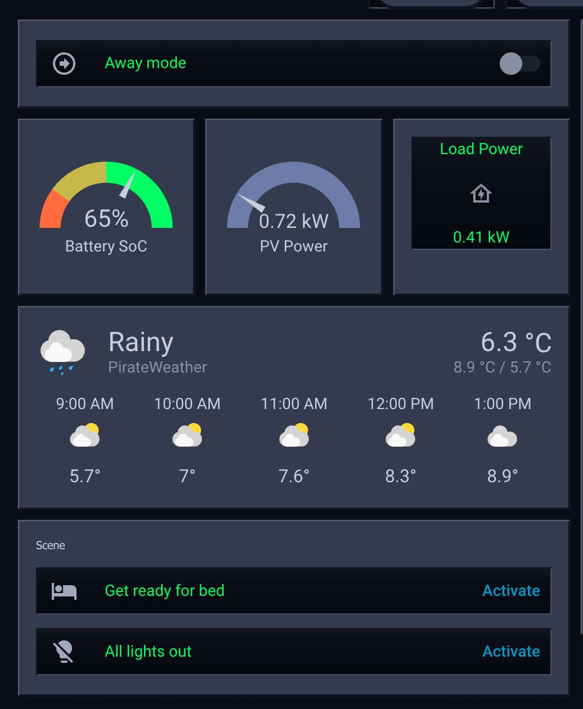

# Winamp Classic for Home Assistant

[](https://www.jonmunson.co.uk)
[](https://x.com/jonmunson)
[](https://www.linkedin.com/in/jonmunson/)
[](https://buymeacoffee.com/jonmunson)

Home Assistant theme inspired by the default Winamp 5.9.2 skin: dark navy chrome, metallic blue-grey panels, gold trim, and black display surfaces with neon green accents.



## Overview

The theme focuses on:

- dark navy title bars with gold separators
- blue-grey chassis panels
- black playlist and display surfaces
- neon green status and playlist text
- silver and gold control accents
- hard beveled, square-edged cards
- darker inset panes for graphs, tables, and media displays

It also includes styling for [`mini-graph-card`](https://github.com/kalkih/mini-graph-card), and it supports a higher-fidelity mode through `card-mod`.

## Prerequisites

- **Home Assistant** with themes enabled (see Installation below)
- **HACS** for the recommended install method
- **[card-mod](https://github.com/thomasloven/lovelace-card-mod)** — required for enhanced (full-fidelity) mode only. Install it via HACS before following the enhanced setup guide.

## Installation

Home Assistant must be configured to load themes. If you do not already have this in `configuration.yaml`, add:

```yaml
frontend:
  themes: !include_dir_merge_named themes
```

Restart Home Assistant after changing `configuration.yaml`.

### HACS

1. In Home Assistant, open HACS.
2. Go to **Frontend**, open the overflow menu (⋮) and choose **Custom repositories**.
3. Add `https://github.com/jonmunson/ha-winamp-theme` and select the **Theme** category.
4. Search for `Winamp Classic` and install it.
5. Run the `frontend.reload_themes` action, or restart Home Assistant.
6. Select `Winamp Classic` in your user profile under **Theme**.

### Manual

1. Copy `themes/winamp_classic.yaml` into your Home Assistant `themes/` directory.
2. Run the `frontend.reload_themes` action, or restart Home Assistant.
3. Select `Winamp Classic` in your user profile under **Theme**.

## Fidelity Modes

There are two ways to use the theme:

- **Standard mode:** uses the theme by itself and applies the Winamp palette, pane treatment, bevels, and typography.
- **Enhanced mode:** adds sidebar, dialog, popup, row, and component chrome through `card-mod`. This is the closest match to the Winamp reference. Requires [card-mod](https://github.com/thomasloven/lovelace-card-mod).

If you want the enhanced version, follow the setup guide in [docs/full_fidelity.md](docs/full_fidelity.md).

## Included Support

The theme includes styling for:

- core Home Assistant cards and dialogs
- Energy dashboard surfaces
- media player cards and more-info dialogs
- [`mini-graph-card`](https://github.com/kalkih/mini-graph-card)

## Notes

Home Assistant themes can get very close to the Winamp look, but the most accurate version depends on `card-mod` because some global surfaces are not fully themeable with built-in Home Assistant variables alone.

If HACS does not show an update immediately:

1. Update the repository in HACS.
2. Run `frontend.reload_themes`.
3. Hard refresh the browser.
4. Restart Home Assistant if you use the `card-mod` frontend module.

## Contributing

Issues and pull requests are welcome. For release notes and the HACS update flow, see [docs/releases.md](docs/releases.md).

## License

MIT — see [LICENSE](LICENSE).

---

### Who made this?

I'm **Jon Munson** - I like building simple things that solve real problems.

**Your support helps me keep building:** maintaining repos, refining themes, and improving the details.

[](https://buymeacoffee.com/jonmunson)
[](https://www.jonmunson.co.uk)
[](https://x.com/jonmunson)
[](https://www.linkedin.com/in/jonmunson/)
