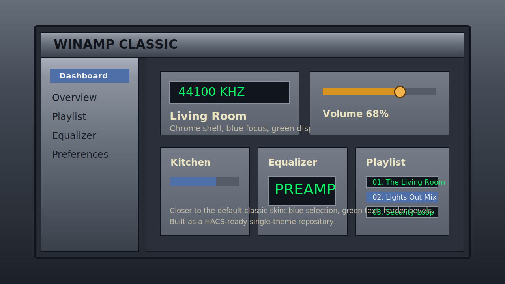

# Winamp Classic for Home Assistant

Home Assistant theme tuned to the Winamp 5.9.2 default skin shown on Wikipedia: dark navy title bars, blue-grey chassis panels, gold controls, and black display surfaces with neon green text.



## What this is

This repository is structured as a HACS theme repo, so once it is pushed to GitHub it can be added to any Home Assistant instance through HACS as a custom repository.

The theme is tuned around the referenced Winamp 5.9.2 screenshot:

- dark navy title bars with gold separators
- blue-grey chassis panels
- black playlist and display surfaces
- neon green status and playlist text
- yellow and gold control accents
- hard beveled, square-edged cards
- brighter dialog and button chrome
- stronger black display treatment for lists, badges, and inputs

## Fidelity levels

There are two ways to use the repo:

- Theme only: installs cleanly through HACS and applies the Winamp palette, spacing, and core component styling.
- Full fidelity: adds card-by-card, row, dialog, header, and sidebar chrome through `card-mod` theme hooks. This is the version that pushes closest to the screenshot.

For the full fidelity path, install `card-mod` through HACS and load it as a frontend module. The official card-mod docs note that frontend-module loading improves functionality and is required when styling non-dashboard panels such as the sidebar.

## Installation

Add the following to your `configuration.yaml` if you do not already load themes:

```yaml
frontend:
  themes: !include_dir_merge_named themes
```

Restart Home Assistant after changing `configuration.yaml`.

### HACS

1. Push this repository to GitHub.
2. In Home Assistant, open HACS.
3. Open the menu in the top right and choose `Custom repositories`.
4. Add your GitHub repository URL and select the `Theme` category.
5. Install `Winamp Classic`.
6. Run the `frontend.reload_themes` action, or restart Home Assistant.
7. Select `Winamp Classic` in your user profile.

### Full fidelity with card-mod

If you want the detailed header, sidebar, dialog, row, and component chrome included in this theme:

1. Install `card-mod` from HACS.
2. In Home Assistant, open `Settings -> Dashboards -> Resources` and copy the `card-mod.js` resource URL HACS added.
3. Add that resource URL to `frontend.extra_module_url` in `configuration.yaml`.
4. Restart Home Assistant.
5. Keep the dashboard resource entry HACS created; do not remove it.

Example:

```yaml
frontend:
  themes: !include_dir_merge_named themes
  extra_module_url:
    - /hacsfiles/lovelace-card-mod/card-mod.js?hacstag=YOUR_HACS_TAG
```

Detailed notes: [docs/full_fidelity.md](docs/full_fidelity.md)

### Manual

1. Copy `themes/winamp_classic.yaml` into your Home Assistant `themes/` directory.
2. Run the `frontend.reload_themes` action, or restart Home Assistant.
3. Select `Winamp Classic` in your user profile.

## Repo layout

- `themes/winamp_classic.yaml`: theme definition HACS installs
- `hacs.json`: HACS manifest for a single theme file
- `.github/workflows/validate.yaml`: HACS validation workflow

## Notes

Home Assistant themes can control colors, spacing, shadows, and many component surfaces, but the closest clone in this repo comes from combining the theme with `card-mod` theme hooks. The plain theme works on its own; the full Winamp window chrome needs `card-mod`.
